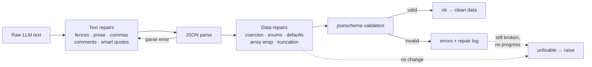

# schema-guard

Stop hand-rolling `try/except json.loads(...)` cleanup code. **schema-guard** takes a raw LLM text output and a JSON Schema, and returns validated data — automatically repairing the failure modes language models produce in the wild.

Typical breakage it fixes, deterministically:

| LLM habit | Repair |
|---|---|
| ```` ```json … ``` ```` fences and chatty prose around the payload | unwraps fence, extracts JSON substring |
| Trailing commas `{"a": 1,}` | removed |
| `// comments` in JSON | removed |
| `"year": "1965"` when the schema wants an integer | coerced |
| `"genre": "Sci-Fi"` vs `enum: ["sci-fi", …]` | case-insensitive match |
| `"tags": "classic"` when the schema wants an array | wrapped as `["classic"]` |
| Unknown keys with `additionalProperties: false` | dropped |
| Over-long strings vs `maxLength` | truncated |
| Missing optional fields with `default:` | filled in |

It never invents values for missing **required** fields — those come back as structured errors with JSON-pointer paths. Every repair is reported as a human-readable action, so nothing changes silently.

## How it works



## Setup

Requires Python 3.10+.

```bash
git clone https://github.com/sulaimanvesal/schema-guard
cd schema-guard
pip install -r requirements.txt
```

## Usage

### Library

```python
from schemaguard import guard

schema = {
    "type": "object",
    "properties": {
        "title": {"type": "string"},
        "year": {"type": "integer"},
        "tags": {"type": "array", "items": {"type": "string"}},
    },
    "required": ["title", "year"],
}

raw = '```json\n{"title": "Dune", "year": "1965", "tags": "sci-fi",}\n```'
result = guard(raw, schema)

print(result.ok)      # True
print(result.data)    # {'title': 'Dune', 'year': 1965, 'tags': ['sci-fi']}
print(result.repairs) # ['unwrapped markdown code fence', 'removed trailing commas',
                      #  "<root>/year: coerced '1965' to integer",
                      #  "<root>/tags: wrapped scalar into single-item array"]

# Fail loudly when the output is truly unusable:
result.raise_for_errors()  # raises ValueError with all schema errors
```

Strict mode (validate only, no repairs):

```python
result = guard(raw, schema, repair=False)
```

### CLI

```bash
# validate + repair an LLM output file
python -m schemaguard --schema schema.json --input output.txt

# read from stdin, print only the repaired JSON on success (pipeline-friendly)
cat output.txt | python -m schemaguard --schema schema.json --quiet

# strict validation, exit code 1 on any problem
python -m schemaguard --schema schema.json --input output.txt --no-repair
```

Output is JSON: `{"ok": true, "data": {...}, "repairs": [...], "errors": [...]}`.

### Demo (no API keys)

```bash
python demo/demo.py
```

Walks through five realistic broken LLM outputs — fences, trailing commas, comments, enum case, over-long strings — and shows what was repaired (plus one genuinely unfixable case).

## API

- `guard(raw: str, schema: dict, *, repair=True, max_passes=3) -> GuardResult` — main entry point.
- `validate(data, schema) -> ValidationReport` — validation with normalized `SchemaError`s (JSON-pointer `path`, `message`, `validator` keyword).
- `repair_text(raw) -> (text, actions)` / `repair_data(data, schema) -> (data, actions)` — the individual repair passes.

## Design notes

- **Conservative repairs only.** Every data-level fix is unambiguous (type coercion of `"42"` → `42`, case-insensitive enum match, `default` fill). Ambiguous guesses — like inventing a missing required value — are refused and reported instead.
- **Transparent.** The `repairs` list tells you exactly what changed, so you can log it, alert on it, or feed repair frequency back into prompt iteration.
- **Iterated to a fixed point.** Repair → validate loops until the output validates or no repair makes progress, so stacked failures (fence + coercion + truncation) resolve in one call.

## Tests

```bash
pytest -v
```

## License

MIT — see [LICENSE](LICENSE).
